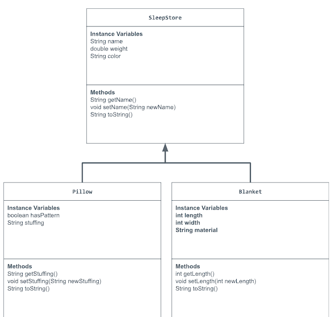

# store-management-project

# Unit 2 - Store Management Project

## Introduction

You are opening a new business in your community! Businesses often need programs to manage the products and services they offer and track orders and requests from customers. Your goal is to create a store management system for your business.

## Requirements

Use your knowledge of object-oriented programming and class structure and design to create your store management system:
- **Create a class hierarchy** – Develop a superclass that represents a product or service your business offers and one or more subclasses that extend the superclass to represent more specific types of products or services.
- **Declare instance variables** – Declare instance variables in the superclass that are shared with the subclasses and instance variables in the subclasses that are not shared with the superclass.
- **Write constructors** – Write no-argument and parameterized constructors in the superclass and subclasses. Subclass constructors use the super keyword to call the superclass constructor.
- **Implement accessor and mutator methods** – Write accessor and mutator methods for instance variables that should be accessible and/or modifiable from outside of the class.
- **Implement a toString() method** – Write toString() methods in the superclass and subclasses that return information about the state of an object.

## UML Diagram

Put and image of your UML Diagram here. Upload the image of your UML Diagram to your repository, then use the Markdown syntax to insert your image here.

## Description

I created a store that sells essentials for sleeping which are pillows and blankets. I chose this topic because I really enjoy napping and wanted to make my project about it as well. I made a super class that creates bedding with no argument and parameterized constructors. Through my superclass I created the base state of my objects and I added on by making two subclasses, Pillow and Blanket, using inheritance I was able to make objects that had new attributes with the super class's instance variables. For my bedding class I made instance variables with Strings and a double for name, color, and weight. For my pillow class I made instance variables with a String and Boolean for stuffing and hasPattern. For my blanket class I made instance variables with a String and integers for material, length and width. I created the accessor and mutator methods for all classes in order to add changes to object's state after its instantiated. Lastly, I made the toString method to create the format for the output of the objects for printing. I believe that through this project I waas able to successfully create a store like real life that fufills the requirements.